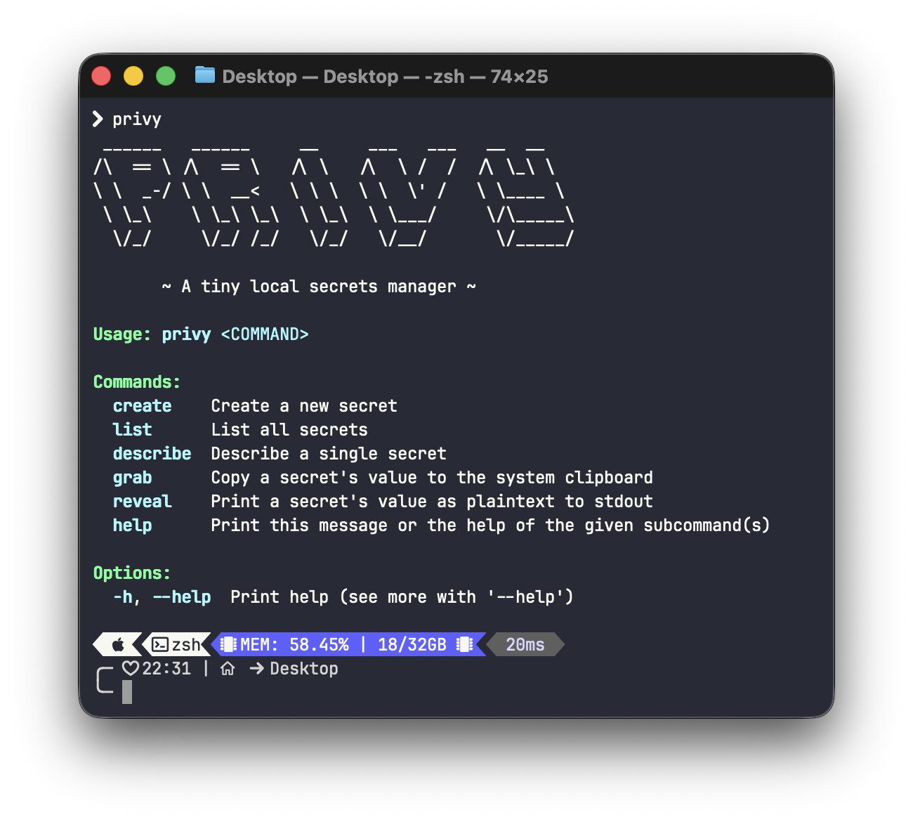

<div align="center">
  

  <h3>Privy</h3>
  <p>A tiny local secrets manager</p>
</div>

---

Privy is a small, fast, local-first secrets manager. 

It stores your secrets in an encrypted database on your machine and gives you a 
simple CLI to create, list, describe, copy, and reveal secrets.

- Very simple - almost naively so - basically just CRUD
- Local-only, no network calls and whatnot
- Encrypted at rest via SQLCipher

## Overview



## Quick start

### 1. Installation

#### From releases (recommended)

[//]: # (TODO)
...

#### With cargo

[//]: # (TODO)
...

### 2. Initialize vault and create a secret

The first command will create an encrypted database at `~/.privy.db` and prompt for 
a vault password (unless `PRIVY_VAULT_PASSWORD` is set).

```bash
# Create a secret named "api-key" (you will be prompted for its value)
privy create api-key -d "Key for Acme API"
```

### 3. Use your secret

```bash
# List secrets (defaults to JSON)
privy list

# List as a pretty table
privy list --format table

# Show metadata (never the value) for a single secret
privy describe api-key --format yaml

# Copy the secret value to your clipboard
privy grab api-key

# Reveal the secret value to stdout (dangerous; will print in your shell history/logs)
privy reveal api-key
```

## Configuration

- Vault password
  - Environment variable: `PRIVY_VAULT_PASSWORD`
  - If this isn't set, `privy` will prompt you for it: `Enter vault password > `
  - If you forget this password, your data cannot be recovered. Back it up on a piece of paper or something.

- Storage location
  - Default path: `~/.privy.db`
  - This is an encrypted SQLite database using SQLCipher.

- Logging
  - Uses `env_logger`. To see verbose logs, set e.g. `RUST_LOG=debug` before running commands.

> [!IMPORTANT]
> `PRIVY_VAULT_PASSWORD` being set as an env variable compromises security for convenience.
> Work is underway to use an alternative mechanism; ideally no passwords involved + the same level of security.

## On Security

- Secrets are encrypted at rest using SQLCipher. The encryption key is derived from the vault password you provide.
- Secret values are never shown in table/JSON/YAML outputs. They are intentionally redacted in "list" and "describe" outputs.
- `grab` decrypts a secret and places it on your system clipboard. Use with care; other apps may access clipboard contents.
- `reveal` prints the decrypted secret to stdout. This is convenient but dangerous on shared machines or when commands are logged.

## Clipboard support

Privy uses the `arboard` crate for cross-platform clipboard access. 
On some Linux environments (headless servers, minimal containers), a system clipboard may not be available. 
If you see errors when using `privy grab`, ensure you are in a graphical session or install/configure the necessary 
clipboard utilities for your environment.

## License

This project is licensed under the MIT License. Do with it what you will!

